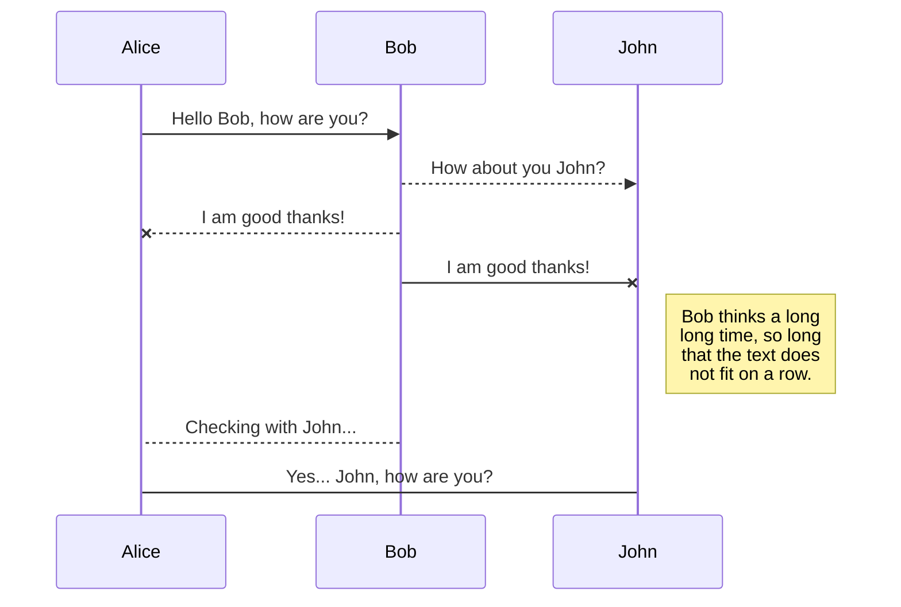
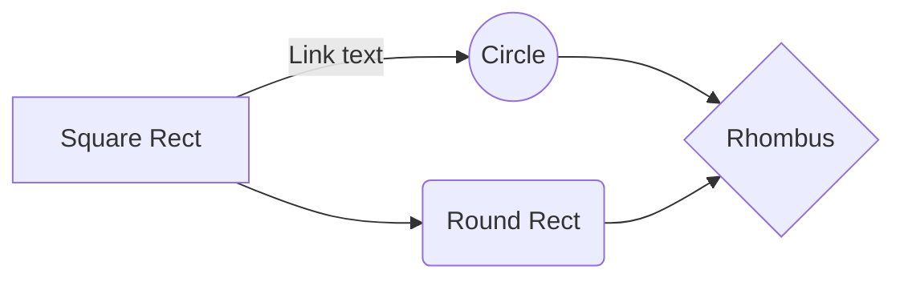
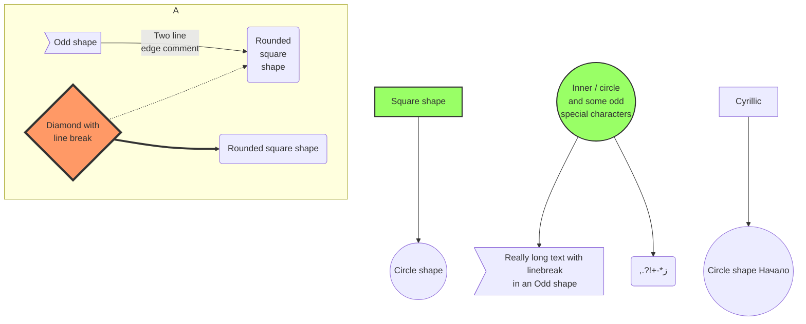
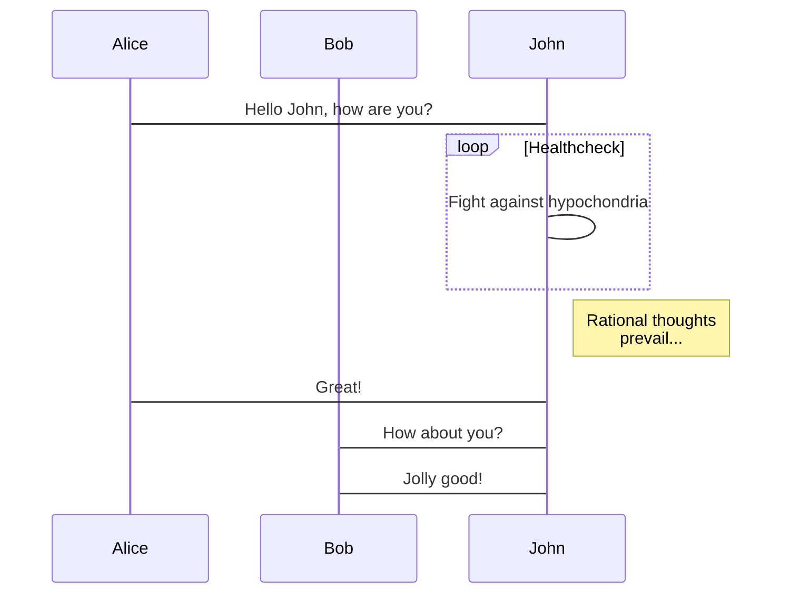
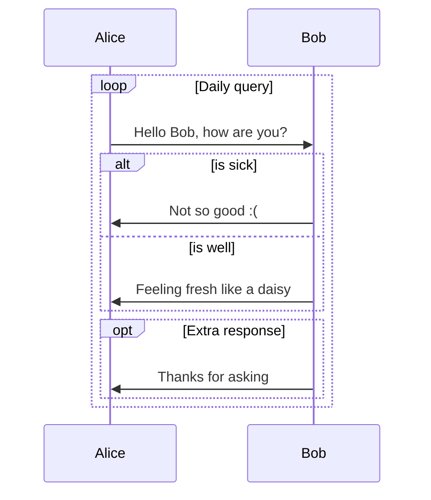
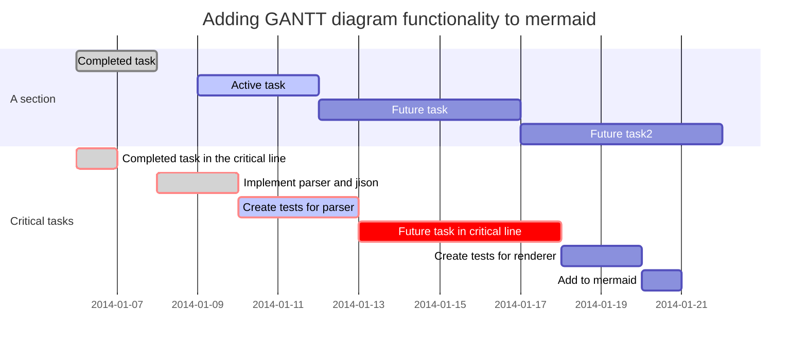

# mermaid

Mermaid ist eine Online(und Offline) Graphen-Library, bei der sich aus Text-Befehlen Graphen rendern lassen. Im Wesentlichen funktioniert es so, dass Sie einen Code-Listing mit der "Programmiersprache" 'mermaid' versehen. Docsify generiert dann daraus ein Bild über einen Online-Dienst.

**Beispiel : Basic sequence diagram**

Folgender Code:
```
sequenceDiagram
    Alice ->> Bob: Hello Bob, how are you?
    Bob-->>John: How about you John?
    Bob--x Alice: I am good thanks!
    Bob-x John: I am good thanks!
    Note right of John: Bob thinks a long<br/>long time, so long<br/>that the text does<br/>not fit on a row.

    Bob-->Alice: Checking with John...
    Alice->John: Yes... John, how are you?
```

generiert folgendes Bild:



> [!TIP]
> Der Vorteil von dieser Art der Doku-Erstellung liegt auf der Hand! Sie können Bilder "mitversioniert" direkt in der Dokumentation erstellen. D.h.: Ihre Bilder in der Doku sind immer aktuell!

## Weitere Beispiele und Anwendungen

* [README](https://mermaidjs.github.io/#/README)
* [Commandline um Graphen zu exportieren](https://github.com/mermaidjs/mermaid.cli)
* [LiveEditor](https://github.com/mermaidjs/mermaid-live-editor)


## Beispiele

### Basic flowchart




### Larger flowchart with some styling




### Flowchart


### Sequence diagram



#### Loops, alt and opt




### Gantt diagram

