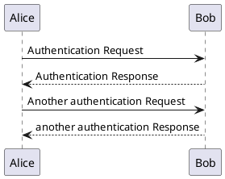
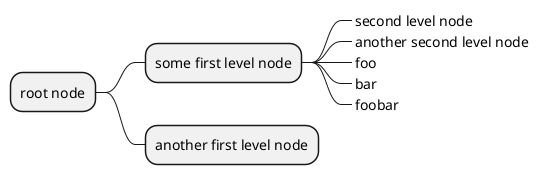
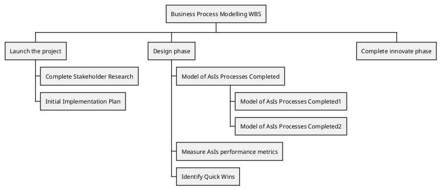
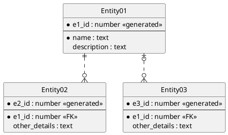
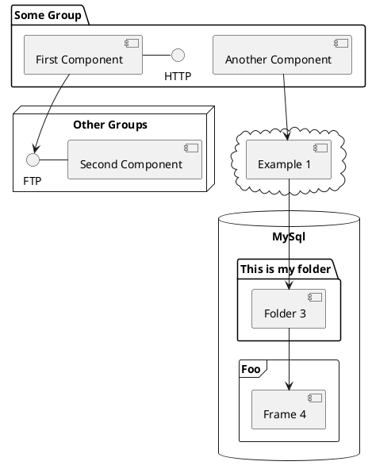

# PlantUML - Rendering

PlantUML funktioniert wie Mermaid ([Siehe Abschnitt: Mermaid](docsify/mermaid.md)) - im Wesentlichen wird textuell eine Graphik beschrieben.
So wird zum Beispiel aus:

```markdown
@startuml
Alice -> Bob: Authentication Request
Bob --> Alice: Authentication Response

Alice -> Bob: Another authentication Request
Alice <-- Bob: another authentication Response
@enduml
```

das hier:


> [!TIP]
> Sie müssen als Listing-Sprache "plantuml" eintragen.


## Beispiele von PlantUML

PlantUML ist relativ alt und hat entsprechend viele Features und Graphen zur Auswahl. Der Fokus liegt auf UML-Diagrammen, und da sind sie auch wirklich gut. 

Hier soll mal nur eine kleine Auswahl von Möglichkeiten gezeigt werden. Alle Beispiele finden Sie [hier](http://plantuml.com/de/index) - den jeweiligen Beispielcode finden Sie der Quelltextanzeige von dieser Doku.

### Mindmaping



### Organigramme



### ERM



### Komponentendiagramm



## Include external Puml-Files (TODO : not yet working)

To include a .puml file into your doc, need to use an sitaxe like the !include from default PUML, but surrounded by [[ and ]].

Ex.:

### Section X

```plantuml
@startuml

[[!include ./demo/my-chart.puml]]


@enduml
```